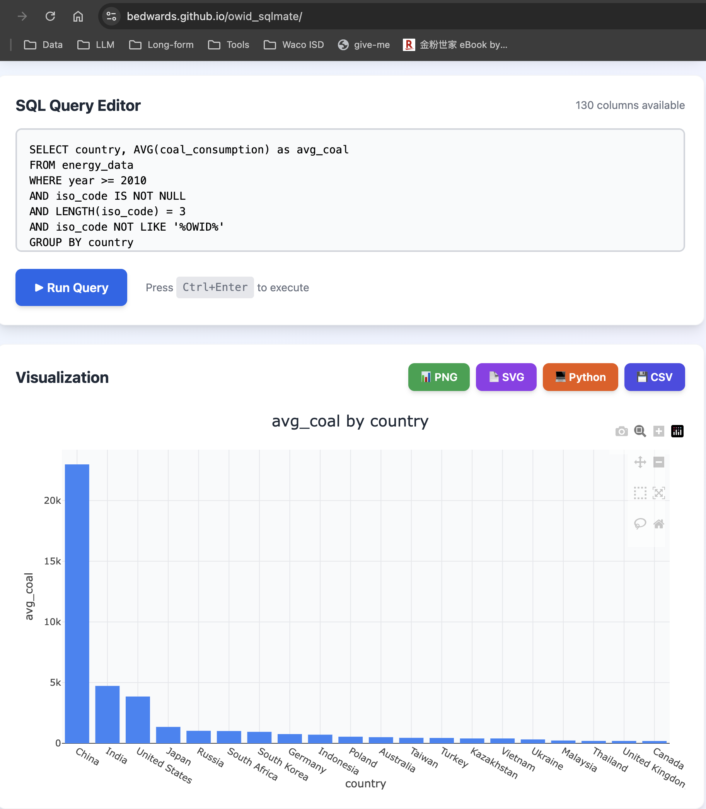
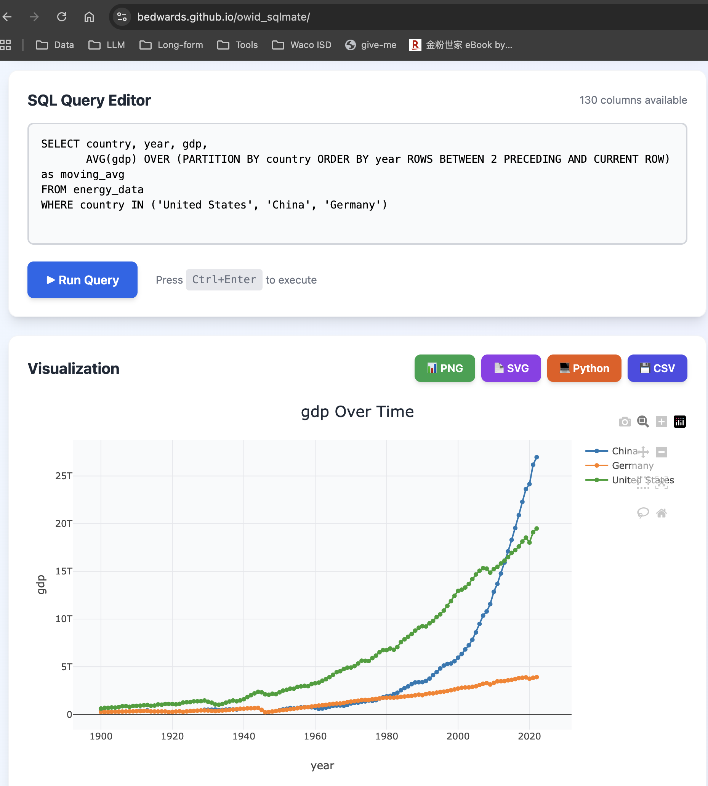

# OWID SQLMate

A fully functional SQL analytics platform for Our World in Data with intelligent chart generation and multiple export options!I've created a fully functional **Our World in Data SQL Analytics Platform** with:

## Queries that work

### Simple query

```
SELECT * FROM energy_data WHERE country = 'United States' LIMIT 100
```

### List countries

```
SELECT country FROM energy_data GROUP BY country
```

### Complex aggregations

```
SELECT country, AVG(coal_consumption) as avg_coal
FROM energy_data 
WHERE year >= 2010
GROUP BY country 
ORDER BY avg_coal DESC 
LIMIT 20
```



### Window functions!

```
SELECT country, year, gdp,
       AVG(gdp) OVER (PARTITION BY country ORDER BY year ROWS BETWEEN 2 PRECEDING AND CURRENT ROW) as moving_avg
FROM energy_data
WHERE country IN ('United States', 'China', 'Germany')
```



## ✨ Key Features

**1. SQL Interface with Auto-complete**
- Real-time suggestions for SQL keywords and column names
- Smart completion as you type

**2. Intelligent Chart Generation**
- Automatically detects data types (numeric, categorical, temporal)
- Chooses optimal chart type (line, bar, scatter, pie) based on query patterns
- Smart axis selection and labeling
- Interactive tooltips with rich HTML formatting

**3. Multiple Export Options**
- **PNG**: High-resolution image export
- **SVG**: Vector graphics for publications
- **Python Notebook**: Generates ready-to-use Kaggle/Colab code

**4. Real OWID Datasets**
- CO2 & Greenhouse Gas Emissions
- COVID-19 data
- Energy data
- Loads directly from Our World in Data repositories

## 🚀 Deployment Instructions

### **GitHub Pages** (Recommended)

1. Create a new repository on GitHub
2. Create `index.html`:

```html
<!DOCTYPE html>
<html>
<head>
    <title>OWID SQL Analytics</title>
    <script crossorigin src="https://unpkg.com/react@18/umd/react.production.min.js"></script>
    <script crossorigin src="https://unpkg.com/react-dom@18/umd/react-dom.production.min.js"></script>
    <script src="https://cdn.tailwindcss.com"></script>
    <script src="https://cdn.plot.ly/plotly-2.27.0.min.js"></script>
</head>
<body>
    <div id="root"></div>
    <script type="module" src="./app.js"></script>
</body>
</html>
```

3. Save the React code as `app.js` (convert JSX to plain JS or use a bundler)
4. Go to Settings → Pages → Deploy from main branch

### **Cloudflare Pages**

1. Push code to GitHub
2. Connect repository to Cloudflare Pages
3. Build command: `npm run build` (if using a bundler)
4. Deploy!

The application is **100% client-side**, loads data directly from OWID GitHub repositories, and requires no backend server - perfect for free hosting! 🎉


